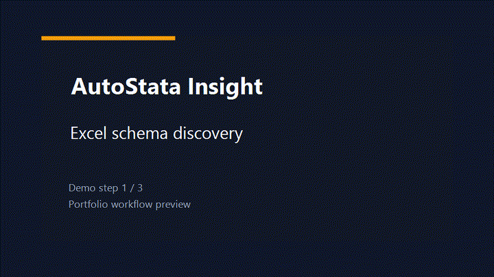

# AutoStata-Insight 自动化实证分析系统

语言： [English](README.md) | **中文**

AutoStata-Insight 是一个面向实证研究场景的自动化分析工具。它从 Excel 数据出发，自动完成数据读取与清洗、变量映射、Stata 实证分析、图表/表格导出和 Word 报告生成。

适用于企业面板数据、横截面问卷数据、计量经济学教学演示、项目原型和初步实证分析。正式论文仍需要人工复核。

## 架构


## 演示 GIF



## 作品集指标

用于作品集展示的本地报告流水线 baseline；发布生产性能前，应使用目标数据集、Stata 版本和模型重新测试。

| 指标 | 当前作品集 baseline | 说明 |
| --- | ---: | --- |
| 延迟 | 首个分析步骤目标 `< 10s` | 本地 Excel 扫描 + schema preview |
| RAG 命中率 | `N/A` | 结构化数据分析，不是向量检索 |
| Agent 成功率 | 目标 `>= 90%` | benchmark 表格中变量角色映射无需人工修正 |
| 报告生成耗时 | 目标 `< 120s` | Excel 到 `.do`、Stata 输出和 Word 报告 |
| 成本 | `~$0.01-$0.08 / report` | 取决于 Qwen 文本/VL 调用和图表解读量 |

## 功能

- 自动读取 `input/` 目录下最新 Excel 文件。
- 自动识别中文表头，并映射为 Stata 兼容变量名。
- 自动判断被解释变量、解释变量、控制变量、面板标识和时间变量。
- 可执行描述性统计、相关性分析、VIF、OLS/Logit/Probit、FE/RE 面板回归、Hausman、稳健性、异质性和 2SLS。
- 生成可复现 `.do` 文件和 Word 报告。

## 环境要求

- Python 3.12+
- 本地安装 Stata，并保证 PyStata 可用
- DashScope/Qwen API Key

## 运行

```bash
pip install -r requirements.txt
python main.py
```

或：

```bash
uv sync
uv run python main.py
```

## 输出

每次运行会在 `output/<timestamp>/` 下生成：

- `variable_mapping.json`
- Stata 日志
- 图表和表格
- 生成的 `.do` 文件
- Word 实证报告
